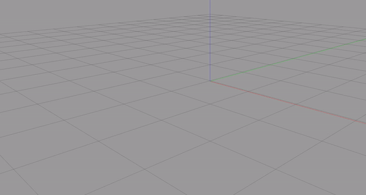
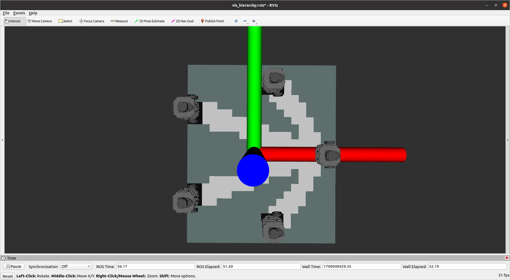
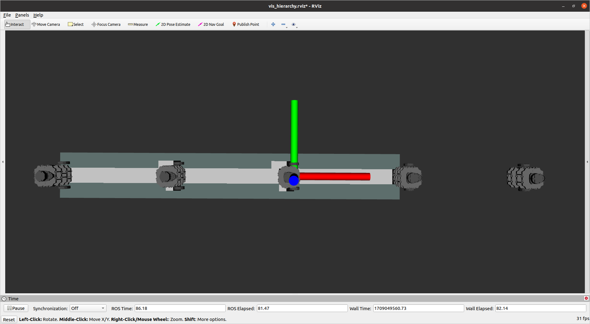
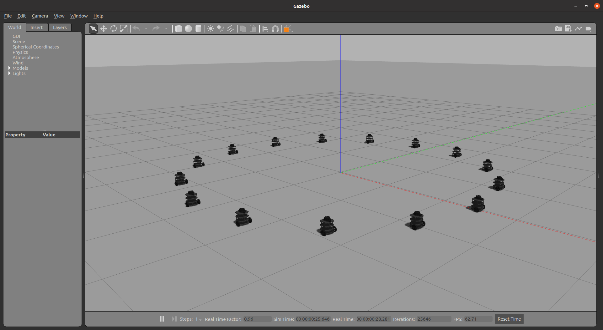
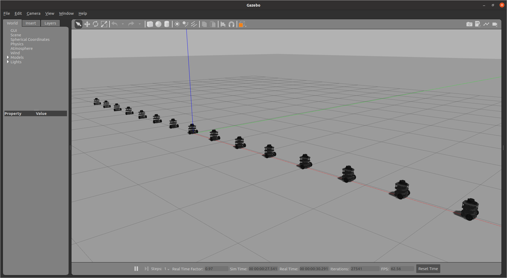
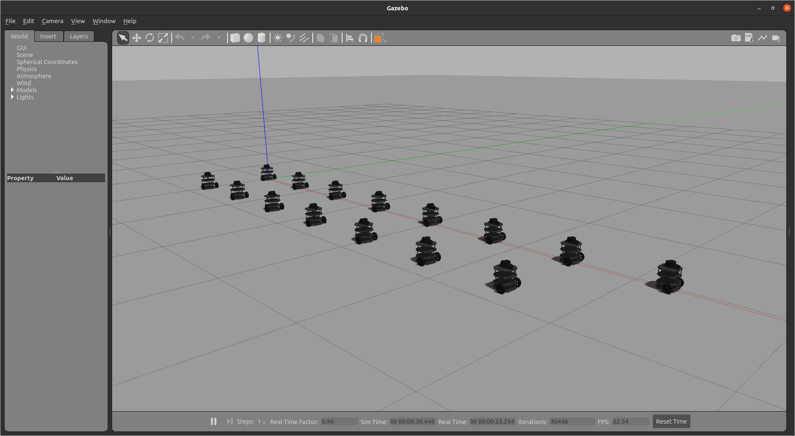
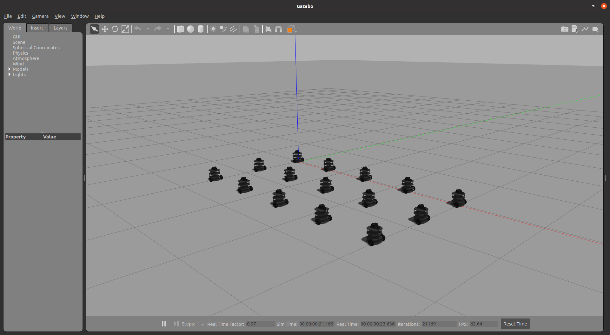

# Spawning Multiple Robots in Gazebo
[](http://wiki.ros.org/ROS/Installation)
[](https://www.python.org/downloads/)
[](http://wiki.ros.org/gazebo_ros_pkgs)

<!-- *(Optional)* -->

This repository contains Python scripts and launch files to spawn multiple robots (turtlebots) in a predefined formation in a Gazebo world. 




## Application
The application of this repository is to spawn multiple robots in a Gazebo world in a predefined formation, which can be used for multi-robot simulations and experiments. The robots are spawned in a formation that can be customized to suit the user's requirements. The robots can be used for various tasks such as multi-robot coordination, exploration, mapping, and navigation.

## Dependencies
The following dependencies are required to run the scripts and launch files in this repository:
- ROS: The Robot Operating System (ROS) is a flexible framework for writing robot software. You can download and install ROS from the official ROS website: [ROS](http://www.ros.org/).
- Gazebo: Gazebo is a 3D dynamic simulator with the ability to accurately and efficiently simulate populations of robots in complex indoor and outdoor environments. You can download and install Gazebo from the official Gazebo website: [Gazebo](http://gazebosim.org/).
- TurtleBot3: TurtleBot3 is a low-cost, personal robot kit with open-source software. You can install the TurtleBot3 packages by following the instructions on the official TurtleBot3 website: [TurtleBot3](https://emanual.robotis.com/docs/en/platform/turtlebot3/overview/).

## Installation
To install the dependencies, follow the installation instructions provided on the official websites of ROS, Gazebo, and TurtleBot3. Make sure to install the required packages and dependencies for each of the software frameworks.

## Usage
To use the scripts and launch files in this repository, follow the steps below:
1. Clone the repository into your catkin workspace:
   ```bash
   cd ~/catkin_ws/src
   git clone git@github.com:MosesEbere/multi_robot_spawn_gazebo.git
    ```
2. Build the packages in the catkin workspace:
    ```bash
    cd ~/catkin_ws
    catkin_make
    ```
3. Source the setup file of the catkin workspace:
    ```bash
    source ~/catkin_ws/devel/setup.bash
    ```
4. Launch the multi-robot spawn launch file to spawn the robots in Gazebo:
    ```bash
    roslaunch multi_robot_spawn_gazebo robot_spawn_coordinator.launch
    ```
5. The robots will be spawned in Gazebo in the predefined formation.

6. Optionally, you can launch the static transform publisher to publish the static transform between the map and the base_footprint frame of each robot:
    ```bash
    roslaunch multi_robot_spawn_gazebo static_tf.launch
    ```

## Launch Files
The following launch files are included in this repository:
- robot_spawn_coordinator.launch: This launch file is used to spawn multiple robots in a predefined formation in a Gazebo world. The number of robots and the formation can be customized by modifying the `params.yaml` file.
  * This launch file also launches the octomap_server (included in `robot_spawn_coordinator.launch`), which is used to generate a map of the environment. In the current setup, one robot is used to generate a reference map.
- static_tf.launch: This launch file is used to publish the static transform between the map and the base_footprint frame of each robot. This is required for the robots to navigate in the environment.
- spawn_multi_robot.launch: This launch file is only generated at runtime and is used to spawn the robots in Gazebo. It is generated by the `robots_gazebo_launch_generator.py` file. Once the robots are spawned, the launch file is reset (with a fixed delay - currently 15 seconds) using the `reset_gazebo_launch.py` node.

**Note**: It is important to wait for the defined delay to ensure that the `reset_gazebo_launch.py` node is called to reset the `spawn_multi_robot.launch:` launch file.

## Customization
The formation of the robots can be customized by modifying the Python scripts and launch files in the repository. The spawn locations and orientations of the robots can be adjusted to create different formations. The number of robots can also be increased or decreased based on the user's requirements.

### Number of Robots
The number of robots to be spawned can be adjusted by modifying the `num_of_robots` entry in the yaml file in the `multi_robot_spawn_gazebo` package. 

### Mapping
In the current setup, one robot is used to generate a reference map. This is determined by setting the `ref_robot_id` entry in the `params.yaml` file. This is loaded to the ROS parameter server by `robot_spawn_coordinator.launch` and becomes assessible to the octomap_server via the `laser_scan_to_point_cloud_node.py` node.

<table>
  <tr>
    <td>
      
      <p>Circle Formation</p>
    </td>
    <td>
      
      <p>Line Formation</p>
    </td>
  </tr>
</table>

From the above, we can see that this method of mapping is not ideal as it is limited by the sensor's range. A better approach would be to have each robot generate its own map and then fuse the maps together. This would allow for a more comprehensive map of the environment.

Here's the tf tree for 2 robots:


### Formation
The formation of the robots can be customized by modifying the `distribution_type` and `distribution_params` entries in the `params.yaml` file. The `distribution_params` entry contains the x and y coordinates of the first or central robot to be spawned, the separation between spawned robots, the direction (horizontal or vertical), and the radius of the formation (only applicable for circular formations). The `distribution_type` entry specifies the type of formation to be created. The following formation types are supported:
- linear: The robots are spawned in a straight line.
- circular: The robots are spawned in a circular formation.
- two_lines: The robots are spawned in two parallel lines.
- three_lines: The robots are spawned in three parallel lines.

<table>
  <tr>
    <td>
      
      <p>Circle Formation</p>
    </td>
    <td>
      
      <p>Line Formation</p>
    </td>
  </tr>
  <tr>
    <td>
      
      <p>Two-line Formation</p>
    </td>
    <td>
      
      <p>Three-line Formation</p>
    </td>
  </tr>
</table>


To create a custom formation, a sub-class of the `Formation` class in the `/launch/spawn_formation.py` file can be created. The user is required to implement the `distribute` method such that it takes in the robot_id `k` and the total number of robots `n`. The method should return the x and y coordinates of the robot to be spawned. Then, the `generate_launch_file` method in the `robots_launch_generator.launch` file should be updated to use the custom formation class.

## Contributing
Contributions to this repository are welcome. Some of the ways to contribute to this repository are:

- Create new formation types and add them to the `spawn_formation.py` file.
- Implement a method to fuse the maps generated by each robot to create a comprehensive map of the environment.
- Add support for different robot models and types.
- Create a method to spawn robots in a real-world environment.
- Determine the optimal method for defining the delay required to reset the dynamic spawning launch file `spawn_multi_robot.launch` using the `reset_gazebo_launch.py` node after the robots have been spawned.

## License
This repository is licensed under the MIT License. See the [LICENSE](LICENSE) file for more details.

## Authors:

- [Moses Ebere](https://github.com/MosesEbere)
- [Joseph Adeola](https://github.com/AdeolaJoseph)
